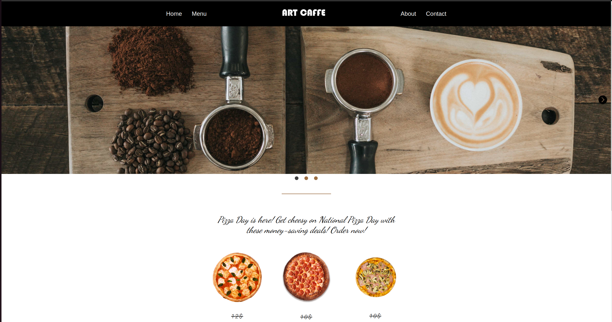
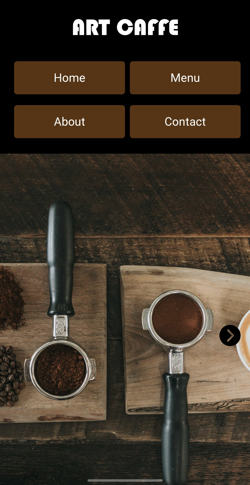

# Restaurant Page

This is a small project for "The Odin Project". The main focus here was to learn how to setup Wepack and how to organize files of the website/project. And then, to make a simple "restuarant page."  But with DOM manipulation  using only JavaScript. 

Also, to figure out how to incorporate the logic for the navigation bar, so that when we click on the button, it clears the main "container" and it's content, and then it appends only the new content on the screen, based on what button we clicked on.

## Extra's I've added

My first idea was a bit different, instead of just creating a random restuarant page with placeholder content, I wanted to make a full website with content that's going to fit the theme. So I've started thinking how will this website look. Also, I've made it in a way so that It's fully responsive on smaller screens. But at the same time to incorporate Webpack and It's features. 
## Demo

https://airdevil188.github.io/restaurant-page/

Desktop Preview:

Mobile Preview:

## Demo

https://airdevil188.github.io/restaurant-page/

## Color Reference

| Color             | Hex                                                                |
| ----------------- | ------------------------------------------------------------------ |
| Navbar Buttons Color |  #563517 |
| Secondary Color |  #9c6f44 |

## Features

- Fully responsive for the smaller screens (tablets and mobile screens)
- Minimalistic lightbox for the images
- Image carousel (image-slider) 

## Things to do

- Implement auto-slide feature to the image carousel
- Optimize images further
- Refactor code  so that it can be reused more
## Feedback

If you have any feedback, please reach out to me: urosculibrk@ymail.com

